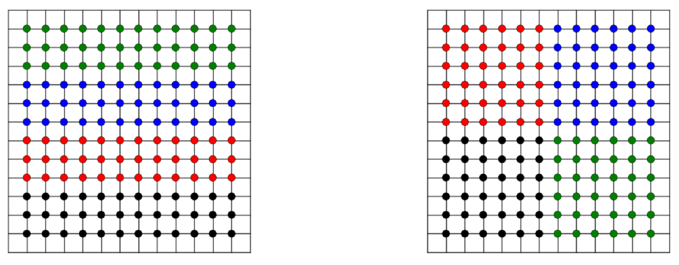

# ME 701 - Homework 10

## Problem 1

Use OpenMP to parallelize the matrix-vector product in C++ based on the 
template provided in `mat_vec.cc`.

## Problem 2

For this problem, you'll use MPI in Python (or, if you're brave, in Fortran or C++)
to solve the same 2-D heat transfer problem we tackled in class using OpenMP.
We'll stick with Cartesian coordinatesand use Jacobi iteration.  For a fixed 
heat generation rate $\dot{Q}$ and thermal conductivity $k$, we have 
\begin{equation}
 \frac{T^{\text{old}}_{i+1,j} + T^{\text{old}}_{i-1,j} + 
       T^{\text{old}}_{i,j+1} + T^{\text{old}}_{i, j-1} - 
       4T^{\text{new}}_{i,j}}
      {\Delta^2} = \frac{\dot{Q}}{k}
\end{equation}
where $x_{i+1}-x_{i} = y_{j+1}-y_{j} = \Delta$.  For simplicity,
assume Dirichlet conditions on all four sides, e.g., on the 
left boundary, $T_{0,j} = T_{\text{left}}$, with similar conditions
on the right, bottom, and top boundaries. 

To parallelize the code, you must select a way by which to divide
the spatial domain among $p$ processes.   Consider a $12\times 12$
grid to be decomposed over 4 processes.  The figure below illustrates
two ways in which one could decompose the domain.  You may implement
your code using either approach.

